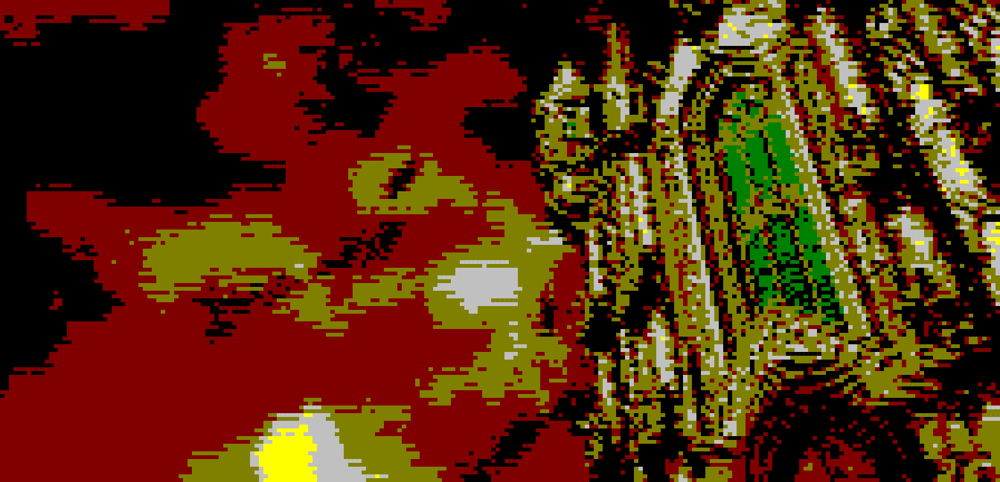

# termimage [](https://travis-ci.org/nabijaczleweli/termimage) [](https://ci.appveyor.com/project/nabijaczleweli/termimage/branch/master) [](LICENSE) [](https://crates.io/crates/termimage)
Display images in your terminal, kind of

## [Documentation](https://cdn.rawgit.com/nabijaczleweli/termimage/doc/termimage/index.html)
## [Manpages](https://cdn.rawgit.com/nabijaczleweli/termimage/man/termimage.1.html)

### Usage

Display an image

```sh
termimage IMAGE_PATH
```

Print all images in a dir to a file.

```sh
(for f in $(find image_dir -type f); do termimage -s 150x33 $f; done) > out_file
```

For more usage examples see [the documentation](https://cdn.rawgit.com/nabijaczleweli/termimage/doc/termimage/index.html).

### Examples

Windows:


Linux with truecolor support:


