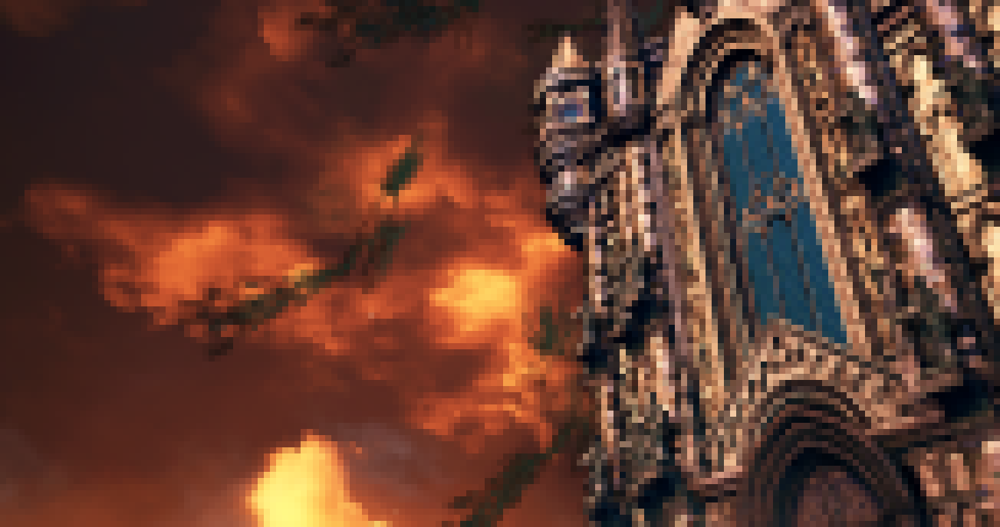

# termimage [](https://travis-ci.org/nabijaczleweli/termimage) [](https://ci.appveyor.com/project/nabijaczleweli/termimage/branch/master) [](LICENSE) [](https://crates.io/crates/termimage)
Display images in your terminal, kind of

## [Documentation](https://rawcdn.githack.com/nabijaczleweli/termimage/doc/termimage/index.html)
## [Manpage](https://rawcdn.githack.com/nabijaczleweli/termimage/man/termimage.1.html)

### Installation

#### From Crates.io

Start by obtaining Rust from https://rustup.rs. Afterwards, run

```sh
cargo install termimage
```

After the installation process finishes, running `termimage` should produce an error message.
If it does, you're ready to move on to the Usage sexion below.

If, however, you've encountered a problem during the installation, do not hesitate to open an issue [here](https://github.com/nabijaczleweli/termimage/issues/new).

#### From pre-built executables

Alternatively, have a glance over at the [releases page](https://github.com/nabijaczleweli/termimage/releases), which should host Windows and Linux x86_64 binaries.

Installation should be a matter of downloading them, marking as executable, and copying somewhere to your `$PATH`.

### Usage

Display an image

```sh
termimage IMAGE_PATH
```

Print all images in a dir to a file.

```sh
(for f in $(find image_dir -type f); do termimage -s 150x33 $f; done) > out_file
```

For more usage examples see [the documentation](https://rawcdn.githack.com/nabijaczleweli/termimage/doc/termimage/index.html).

### Examples

Windows:


Linux with truecolor support:



## Special thanks

To all who support further development on Patreon, in particular:

  * ThePhD
